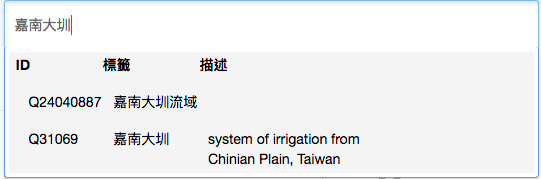

---
jupytext:
  cell_metadata_filter: -all
  formats: md:myst
  text_representation:
    extension: .md
    format_name: myst
    format_version: 0.13
    jupytext_version: 1.11.5
kernelspec:
  display_name: Python 3
  language: python
  name: python3
---
# Average information of metadata
在創建資料集時，使用者會被要求填答後設資料以利檢索或是分析，這裡收集了depositar各種後設資料的填答情況。
<!-- # 這邊放一個照片示意圖 -->
## metadata example



```{code-cell}
print(3+3)
```
```{note} Notes require **no** arguments, so content can start here.
``` 
here is a [reference to the average](avr_code.ipynb).

::::{tab-set}

:::{tab-item} Label1
Content 1
:::

:::{tab-item} Label2
Content 2
:::

::::